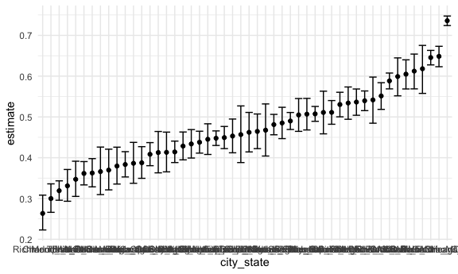
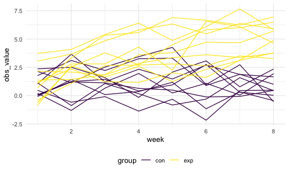
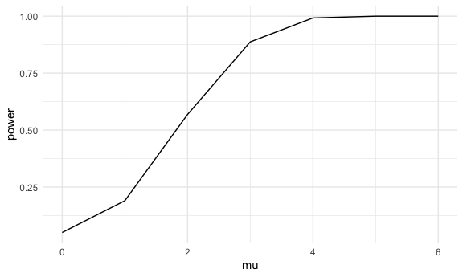
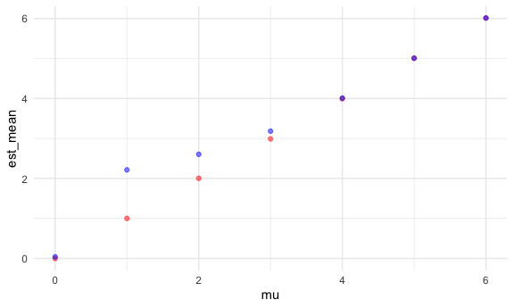

Homework 5
================
Yuqi Wang

``` r
library(tidyverse)
```

    ## ── Attaching packages ─────────────────────────────────────── tidyverse 1.3.0 ──

    ## ✓ ggplot2 3.3.2     ✓ purrr   0.3.4
    ## ✓ tibble  3.0.3     ✓ dplyr   1.0.2
    ## ✓ tidyr   1.1.2     ✓ stringr 1.4.0
    ## ✓ readr   1.3.1     ✓ forcats 0.5.0

    ## ── Conflicts ────────────────────────────────────────── tidyverse_conflicts() ──
    ## x dplyr::filter() masks stats::filter()
    ## x dplyr::lag()    masks stats::lag()

``` r
library(rvest)
```

    ## Loading required package: xml2

    ## 
    ## Attaching package: 'rvest'

    ## The following object is masked from 'package:purrr':
    ## 
    ##     pluck

    ## The following object is masked from 'package:readr':
    ## 
    ##     guess_encoding

``` r
knitr::opts_chunk$set(
  fig.width = 6,
  fig.asp = .6,
  out.width = "90%"
)

theme_set(theme_minimal() + theme(legend.position = "bottom"))

options(
  ggplot2.continuous.colour = "viridis",
  ggplot2.continuous.fill = "viridis"
)

scale_colour_discrete = scale_colour_viridis_d
scale_fill_discrete = scale_fill_viridis_d

set.seed(1)
```

This is my solution for homework 5.

## Problem 1

read in the data

``` r
#city_prop_test = function(df) {
#  n_unsolved ...
#  n_total ...
  
#  prop_test(n_unsolved, n_total)
#}
homicide_df = read_csv(file = "./data/homicide-data.csv") %>% 
  mutate(
    city_state = str_c(city, state, sep = "_"),
    resolved = case_when(
      disposition  == "Closed without arrest" ~ "unsolved",
      disposition  == "Open/No arrest" ~ "unsolved",
      disposition  == "Closed by arrest" ~ "solved",
## case_when is used to create categorical variables
    )
  ) %>% 
  select(city_state, resolved) %>% 
  filter(city_state != "Tulsa_AL") # %>% 
```

    ## Parsed with column specification:
    ## cols(
    ##   uid = col_character(),
    ##   reported_date = col_double(),
    ##   victim_last = col_character(),
    ##   victim_first = col_character(),
    ##   victim_race = col_character(),
    ##   victim_age = col_character(),
    ##   victim_sex = col_character(),
    ##   city = col_character(),
    ##   state = col_character(),
    ##   lat = col_double(),
    ##   lon = col_double(),
    ##   disposition = col_character()
    ## )

``` r
  #nest(data = resolved)
```

Let’s look at this a bit

``` r
aggregate_df = homicide_df %>% 
  group_by(city_state) %>% 
  summarize(
    hom_total = n(),
    hom_unsolved = sum(resolved == "unsolved")
  )
```

    ## `summarise()` ungrouping output (override with `.groups` argument)

Can I do a prop test for a single city?

``` r
prop.test(
  aggregate_df %>% filter(city_state == "Baltimore_MD") %>% pull(hom_unsolved),
  aggregate_df %>% filter(city_state == "Baltimore_MD") %>% pull(hom_total)
  ) %>% 
  broom::tidy()
```

    ## # A tibble: 1 x 8
    ##   estimate statistic  p.value parameter conf.low conf.high method    alternative
    ##      <dbl>     <dbl>    <dbl>     <int>    <dbl>     <dbl> <chr>     <chr>      
    ## 1    0.646      239. 6.46e-54         1    0.628     0.663 1-sample… two.sided

``` r
## make the test result more tidy.
```

Try to iterate…

``` r
results_df = aggregate_df %>% 
  mutate(
    prop_test = map2(.x = hom_unsolved, .y = hom_total, ~prop.test(x = .x, n = .y)),
    tidy_test = map(.x = prop_test, ~broom::tidy(.x))
  ) %>% 
  select(-prop_test) %>% 
  unnest(tidy_test) %>% 
  select(city_state, estimate, conf.low, conf.high)
```

``` r
results_df %>% 
  mutate(city_state = fct_reorder(city_state, estimate)) %>% 
  ggplot(aes(x = city_state, y = estimate)) +
  geom_point() +
  geom_errorbar(aes(ymin = conf.low, ymax = conf.high))
```



``` r
  theme(axis.text.x = element_text(angle = 90, vjust = 0.5, hjust =1))
```

    ## List of 1
    ##  $ axis.text.x:List of 11
    ##   ..$ family       : NULL
    ##   ..$ face         : NULL
    ##   ..$ colour       : NULL
    ##   ..$ size         : NULL
    ##   ..$ hjust        : num 1
    ##   ..$ vjust        : num 0.5
    ##   ..$ angle        : num 90
    ##   ..$ lineheight   : NULL
    ##   ..$ margin       : NULL
    ##   ..$ debug        : NULL
    ##   ..$ inherit.blank: logi FALSE
    ##   ..- attr(*, "class")= chr [1:2] "element_text" "element"
    ##  - attr(*, "class")= chr [1:2] "theme" "gg"
    ##  - attr(*, "complete")= logi FALSE
    ##  - attr(*, "validate")= logi TRUE

## Problem 2 ideas

First, start with a dataframe containing the file names.

``` r
path_df = tibble(
  path = list.files("data/lda_data")
) %>% 
  mutate(
    path = str_c("data/lda_data/", path)
  )
```

Second, import the files and tidy the longitudinal data.

``` r
lda_df = tibble(
  id = path_df$path,
  map_df(.x = path_df$path, ~read_csv(.x))
) %>% 
  mutate(
    id = substr(id, 15, 20),
  ) %>% 
  separate(id, c("group", "id"), sep = "_", remove = TRUE) %>% 
  pivot_longer(
    week_1:week_8,
    names_to = "week",
    names_prefix = "week_",
    values_to = "obs_value"
  ) %>% 
  mutate(id = as.numeric(id),
         week = as.numeric(week))
```

    ## Parsed with column specification:
    ## cols(
    ##   week_1 = col_double(),
    ##   week_2 = col_double(),
    ##   week_3 = col_double(),
    ##   week_4 = col_double(),
    ##   week_5 = col_double(),
    ##   week_6 = col_double(),
    ##   week_7 = col_double(),
    ##   week_8 = col_double()
    ## )
    ## Parsed with column specification:
    ## cols(
    ##   week_1 = col_double(),
    ##   week_2 = col_double(),
    ##   week_3 = col_double(),
    ##   week_4 = col_double(),
    ##   week_5 = col_double(),
    ##   week_6 = col_double(),
    ##   week_7 = col_double(),
    ##   week_8 = col_double()
    ## )
    ## Parsed with column specification:
    ## cols(
    ##   week_1 = col_double(),
    ##   week_2 = col_double(),
    ##   week_3 = col_double(),
    ##   week_4 = col_double(),
    ##   week_5 = col_double(),
    ##   week_6 = col_double(),
    ##   week_7 = col_double(),
    ##   week_8 = col_double()
    ## )
    ## Parsed with column specification:
    ## cols(
    ##   week_1 = col_double(),
    ##   week_2 = col_double(),
    ##   week_3 = col_double(),
    ##   week_4 = col_double(),
    ##   week_5 = col_double(),
    ##   week_6 = col_double(),
    ##   week_7 = col_double(),
    ##   week_8 = col_double()
    ## )
    ## Parsed with column specification:
    ## cols(
    ##   week_1 = col_double(),
    ##   week_2 = col_double(),
    ##   week_3 = col_double(),
    ##   week_4 = col_double(),
    ##   week_5 = col_double(),
    ##   week_6 = col_double(),
    ##   week_7 = col_double(),
    ##   week_8 = col_double()
    ## )
    ## Parsed with column specification:
    ## cols(
    ##   week_1 = col_double(),
    ##   week_2 = col_double(),
    ##   week_3 = col_double(),
    ##   week_4 = col_double(),
    ##   week_5 = col_double(),
    ##   week_6 = col_double(),
    ##   week_7 = col_double(),
    ##   week_8 = col_double()
    ## )
    ## Parsed with column specification:
    ## cols(
    ##   week_1 = col_double(),
    ##   week_2 = col_double(),
    ##   week_3 = col_double(),
    ##   week_4 = col_double(),
    ##   week_5 = col_double(),
    ##   week_6 = col_double(),
    ##   week_7 = col_double(),
    ##   week_8 = col_double()
    ## )
    ## Parsed with column specification:
    ## cols(
    ##   week_1 = col_double(),
    ##   week_2 = col_double(),
    ##   week_3 = col_double(),
    ##   week_4 = col_double(),
    ##   week_5 = col_double(),
    ##   week_6 = col_double(),
    ##   week_7 = col_double(),
    ##   week_8 = col_double()
    ## )
    ## Parsed with column specification:
    ## cols(
    ##   week_1 = col_double(),
    ##   week_2 = col_double(),
    ##   week_3 = col_double(),
    ##   week_4 = col_double(),
    ##   week_5 = col_double(),
    ##   week_6 = col_double(),
    ##   week_7 = col_double(),
    ##   week_8 = col_double()
    ## )
    ## Parsed with column specification:
    ## cols(
    ##   week_1 = col_double(),
    ##   week_2 = col_double(),
    ##   week_3 = col_double(),
    ##   week_4 = col_double(),
    ##   week_5 = col_double(),
    ##   week_6 = col_double(),
    ##   week_7 = col_double(),
    ##   week_8 = col_double()
    ## )
    ## Parsed with column specification:
    ## cols(
    ##   week_1 = col_double(),
    ##   week_2 = col_double(),
    ##   week_3 = col_double(),
    ##   week_4 = col_double(),
    ##   week_5 = col_double(),
    ##   week_6 = col_double(),
    ##   week_7 = col_double(),
    ##   week_8 = col_double()
    ## )
    ## Parsed with column specification:
    ## cols(
    ##   week_1 = col_double(),
    ##   week_2 = col_double(),
    ##   week_3 = col_double(),
    ##   week_4 = col_double(),
    ##   week_5 = col_double(),
    ##   week_6 = col_double(),
    ##   week_7 = col_double(),
    ##   week_8 = col_double()
    ## )
    ## Parsed with column specification:
    ## cols(
    ##   week_1 = col_double(),
    ##   week_2 = col_double(),
    ##   week_3 = col_double(),
    ##   week_4 = col_double(),
    ##   week_5 = col_double(),
    ##   week_6 = col_double(),
    ##   week_7 = col_double(),
    ##   week_8 = col_double()
    ## )
    ## Parsed with column specification:
    ## cols(
    ##   week_1 = col_double(),
    ##   week_2 = col_double(),
    ##   week_3 = col_double(),
    ##   week_4 = col_double(),
    ##   week_5 = col_double(),
    ##   week_6 = col_double(),
    ##   week_7 = col_double(),
    ##   week_8 = col_double()
    ## )
    ## Parsed with column specification:
    ## cols(
    ##   week_1 = col_double(),
    ##   week_2 = col_double(),
    ##   week_3 = col_double(),
    ##   week_4 = col_double(),
    ##   week_5 = col_double(),
    ##   week_6 = col_double(),
    ##   week_7 = col_double(),
    ##   week_8 = col_double()
    ## )
    ## Parsed with column specification:
    ## cols(
    ##   week_1 = col_double(),
    ##   week_2 = col_double(),
    ##   week_3 = col_double(),
    ##   week_4 = col_double(),
    ##   week_5 = col_double(),
    ##   week_6 = col_double(),
    ##   week_7 = col_double(),
    ##   week_8 = col_double()
    ## )
    ## Parsed with column specification:
    ## cols(
    ##   week_1 = col_double(),
    ##   week_2 = col_double(),
    ##   week_3 = col_double(),
    ##   week_4 = col_double(),
    ##   week_5 = col_double(),
    ##   week_6 = col_double(),
    ##   week_7 = col_double(),
    ##   week_8 = col_double()
    ## )
    ## Parsed with column specification:
    ## cols(
    ##   week_1 = col_double(),
    ##   week_2 = col_double(),
    ##   week_3 = col_double(),
    ##   week_4 = col_double(),
    ##   week_5 = col_double(),
    ##   week_6 = col_double(),
    ##   week_7 = col_double(),
    ##   week_8 = col_double()
    ## )
    ## Parsed with column specification:
    ## cols(
    ##   week_1 = col_double(),
    ##   week_2 = col_double(),
    ##   week_3 = col_double(),
    ##   week_4 = col_double(),
    ##   week_5 = col_double(),
    ##   week_6 = col_double(),
    ##   week_7 = col_double(),
    ##   week_8 = col_double()
    ## )
    ## Parsed with column specification:
    ## cols(
    ##   week_1 = col_double(),
    ##   week_2 = col_double(),
    ##   week_3 = col_double(),
    ##   week_4 = col_double(),
    ##   week_5 = col_double(),
    ##   week_6 = col_double(),
    ##   week_7 = col_double(),
    ##   week_8 = col_double()
    ## )

``` r
lda_df
```

    ## # A tibble: 160 x 4
    ##    group    id  week obs_value
    ##    <chr> <dbl> <dbl>     <dbl>
    ##  1 con       1     1      0.2 
    ##  2 con       1     2     -1.31
    ##  3 con       1     3      0.66
    ##  4 con       1     4      1.96
    ##  5 con       1     5      0.23
    ##  6 con       1     6      1.09
    ##  7 con       1     7      0.05
    ##  8 con       1     8      1.94
    ##  9 con       2     1      1.13
    ## 10 con       2     2     -0.88
    ## # … with 150 more rows

Third, make the plot to show observations of each subject over time.

``` r
lda_df %>% 
  ggplot(aes(x = week, y = obs_value, group = interaction(id, group), color = group)) +
  geom_line()
```



Difference between groups:

From the spaghetti plot, we found that the observed values for the
control group and the experimental group were about the same at Week 1.
As time went by, the observed values for people in the experimental arm
was getting larger, while the values for the control group did not
change. The difference in the observed value between the two groups was
larger after 8 weeks’ follow up.

## Problem 3

First, build the first function to obtain the estimated mean and p-value
from repetive sampling, and then build the second function to obtain the
average estimated mean and power.

``` r
# sampling function
sam_mean_p = function(samp_size, mu, sigma){
  sam_data = tibble(
    x = rnorm(samp_size, mean = mu, sd = sigma)
  ) #%>% 
    #t.test(x, mu = mu, conf.level = 0.95)
  result = t.test(sam_data, mu = 0) %>% 
    broom::tidy() %>% 
    select(estimate, p.value)
  return(result)
}


# power calculation function
power_cal = function(n, samp_size, mu, sigma){
  sim_result = rerun(n, sam_mean_p(samp_size, mu, sigma)) %>% 
    bind_rows() %>% 
  mutate(
    conclusion = case_when(
      p.value < 0.05 ~ "reject",
      p.value >= 0.05 ~ "fail to reject"
    )
  )
  
  total_sum = sim_result %>% 
    summarise(
      mu = mu,
      est_mean = mean(estimate),
      power = sum(conclusion == "reject")/n()
    )
  
  rej_sum = sim_result %>% 
    filter(conclusion == "reject") %>% 
    summarise(est_mean_rej = mean(estimate))
  
  result = bind_cols(total_sum, rej_sum) %>% 
    relocate(mu, est_mean, est_mean_rej, power)
  
  return(result)
}

power_cal(100, 30, 0, 5)
```

    ## # A tibble: 1 x 4
    ##      mu est_mean est_mean_rej power
    ##   <dbl>    <dbl>        <dbl> <dbl>
    ## 1     0  -0.0210       -0.225  0.05

Next, run the power calculation for `mu = {0,1,2,3,4,5,6}`

``` r
mu_list = list(0,1,2,3,4,5,6)

output = map(.x = mu_list, ~power_cal(5000, 30, .x, 5)) %>% 
  bind_rows()
```

Then, plot the power and the true value of mu.

``` r
output %>% 
  ggplot(aes(x = mu, y = power)) +
  geom_line()
```



With the effect size increasing, the power will increase, given that
alpha and sample size do not change.

Last, make two plots.

``` r
output %>% 
  ggplot(aes(x = mu)) +
  geom_point(aes(y = est_mean), color = "red", alpha = .5) +
  geom_point(aes(y = est_mean_rej), color = "blue", alpha = .5)
```



From the plot, we found that the sample average of estimated mu across
tests for which the null is rejected is different from the true value of
mu when mu = 1, 2, 3, and the two values are approximately the same when
mu = 0,4,5,6.

Reasons:

  - When mu = 0, the proportion of rejecting the null is only 5.06%.
    Since these samples with rejecting the null are still normally
    distributed with mu = 0, the estimated mean for it will be still
    near to 0.

  - When mu = 1, 2, 3, under the null hypothesis, most of the samples
    that reject the null will be the samples with larger estimated mean
    (right side of the null distribution), while samples with smaller
    means will not reject the null, so that the average estimated mean
    for these samples rejecting the null will be away from the
    originally set mu.

  - When mu = 4, 5, 6, almost all the ttests reject the null, so the
    average estimated mean for these samples will be approximate to the
    original mu.
